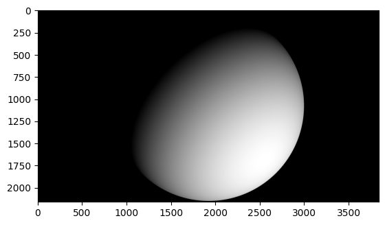
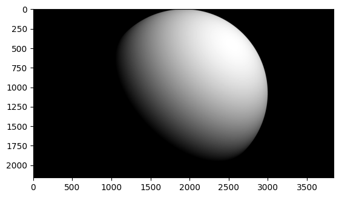
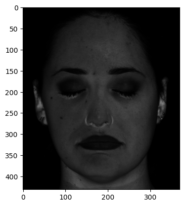
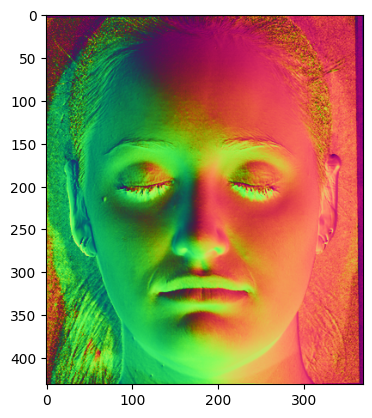
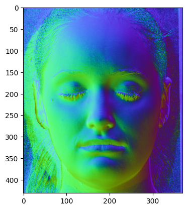
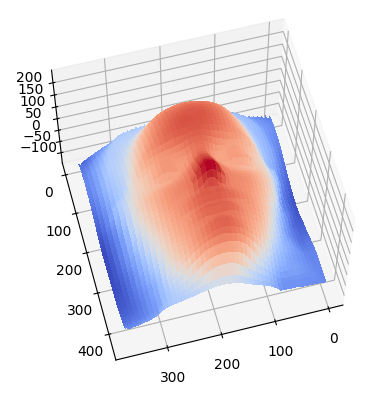
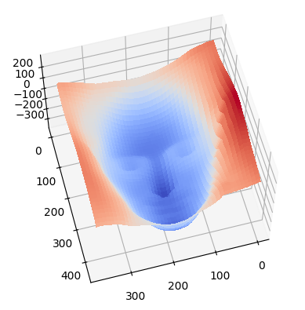
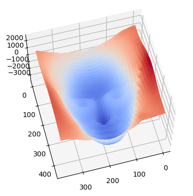

# Photometric-Stereo-Vision

This project implements **photometric stereo techniques** to reconstruct 3D surfaces from multiple images taken under different lighting conditions.
##Implementation examples

When a hemispherical surface is rendered with different lighting conditions:

 

For a basic face, this method can be applied to improve the detailing of the surfacial visualization:

This is if the lighting direction is known

If the setup is uncalibrated, the result can be a bit different:

Eventually, this can be rendered into a 3D surface:

By using the **Bas-Relief Ambiguity** we can change the way it gets rendered in terms of sharpness and flatness

 

---

## Features

- **Calibrated and uncalibrated photometric stereo**  
- **Normal and albedo estimation**  
- **Surface reconstruction using Frankot-Chellappa algorithm**  
- **Bas-relief ambiguity visualization**  

---

## Implementation Details

### Calibrated Photometric Stereo
- Estimates **pseudonormals** using known light directions
- Calculates **albedos** and **surface normals**
- Integrates normals to recover the **depth map**

### Uncalibrated Photometric Stereo
- Estimates **light directions** and **pseudonormals** using Singular Value Decomposition (SVD)
- Enforces **integrability constraint** on normals
- Demonstrates **bas-relief ambiguity** through parameter adjustments

---

## Key Functions

- **`estimatePseudonormalsCalibrated`**: Computes pseudonormals for the calibrated case  
- **`estimateAlbedosNormals`**: Extracts albedos and normals from pseudonormals  
- **`estimateShape`**: Integrates surface normals to obtain a depth map  
- **`estimatePseudonormalsUncalibrated`**: Performs uncalibrated photometric stereo  
- **`enforceIntegrability`**: Applies integrability constraint to normals  
- **`plotBasRelief`**: Visualizes bas-relief transformations  

---

## Usage

1. Load image data and light directions  
2. Run **calibrated** or **uncalibrated photometric stereo**  
3. Visualize results, including:  
   - Albedo map  
   - Normal map  
   - 3D surface reconstruction  

---
